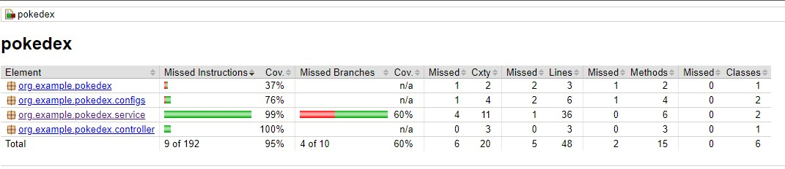

# Pokedex Application

A simple application to search for pokemons using the publickly available api from https://pokeapi.co/

## How to run

You will need docker installed in your computer. Download it from here
https://docs.docker.com/get-docker/


Please run the following commands
```
docker build -t example/pokedex .
docker run -p 8080:8080 example/pokedex
```

Once it's running, you can test the rest api on the app using swagger-ui
`http://localhost:8080/swagger-ui.html`


## Setup for development

You will need the following libs before we start the dev environment
- maven - https://maven.apache.org/install.html
- java sdk 11 - https://docs.aws.amazon.com/corretto/latest/corretto-11-ug/downloads-list.html

Make sure that the IDE that you're using auto builds/compiles on changes to java file.

Then you can start the application with the command below

`mvn spring-boot:run`

Everytime you modify the code, the application will be hot restarted
to push the new changes you made into the current context

## Tests

To view current test coverage of 95% please open `/target/site/jacoco/index.html`




## Extra consideration for production API

More robust error handling. Errors on translations are simply ignored, and original description is preserved in case of error, but currently error handling on https://pokeapi.co/ isn't handled cleanly, the default framework error handling takes over.
Rest api analytics features.

To be removed
- Jar file - it has been added to repo to make it simpler to run it via docker without installing other framework based dependencies
- Code coverage files - just for easy access
